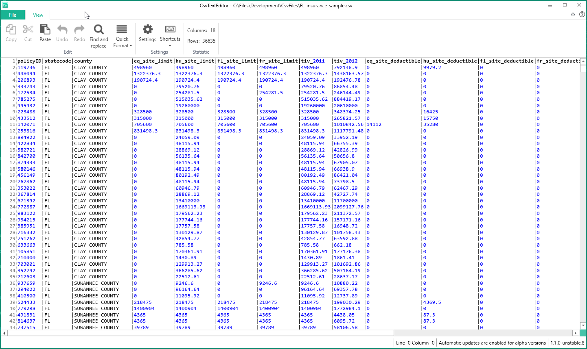
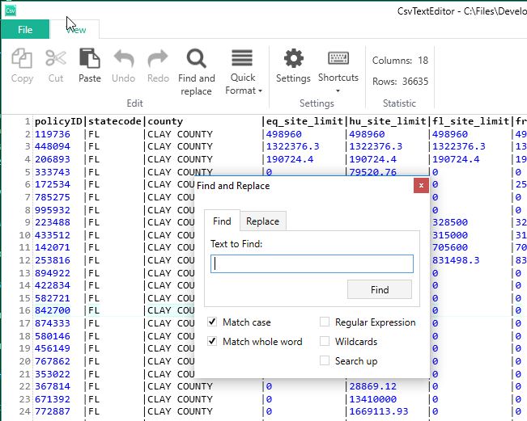
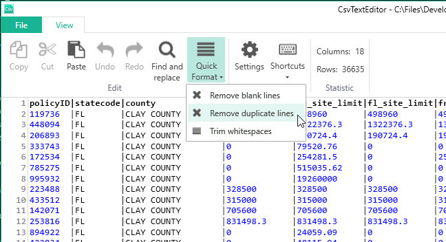

# CsvTextEditor

Is a free, simple to use csv text editor application.

It is built with:

- [Orchestra](https://github.com/WildGums/Orchestra)
- [Orc.CsvTextEditor](https://github.com/WildGums/Orc.CsvTextEditor)
- [AvalonEdit](http://avalonedit.net/) 
- Loosely implements [Elastic-tabstops](http://nickgravgaard.com/elastic-tabstops/) in the background (i.e. instead of tabstops we use commas as the separators).

We have purposely kept the control simple.

We welcome all pull requests, however please discuss large feature implementations ahead of time.

## Download

Download the latest version from the [release page](https://github.com/WildGums/CsvTextEditor/releases)

## Goal

We work with a lot of csv files on a daily basis and wanted a no-nonsense, quick and simple tool to edit csv files.

We found that Excel reformats csv files  when saving a file, which causes us a lot of issues. (Like changing date formats and stripping out leading '0').

Essentially CsvTextEditor is a simple "text editor" with some extra features that make it easy to edit csv files and will not reformat the file in anyway.

## Limitations

Please read this section carefully.

### Speed

The control is effective with relatively small csv files. It **is not** designed to deal with large files with more than 100K rows or over 1MB in size.

Our use case is typically 20 columns (or less) and a few hundred rows.

We would welcome any efforts to improve the performance if someone was willing to tackle this issue.

### Csv format

**We only support _simple_ comma separated files**. (i.e. we expect the csv files to be fairly clean and **do not** support quotes, imbedded commas or new lines within the text.)

We would also welcome a PR that allowed CsvTextEditor to handle more cases.

## Features

- All the features available in AvalonEdit are also available in CsvTextEditor
- Display the columns using elastic formating
- Line and column number are in the status bar (bottom right corner)
- Highlight word (Just select some characters or double click on a word and the same occurrences will be highlighted.)
- Easy navigation between "cells" (Arrows, Tab, SHIFT + Tab)
- Undo/Redo
- Column widths will automatically re-adjust after editing
- Syntax highlighting (Numbers are shown in blue font)
- Automatically highlight "True/False" and  "Yes/No" values
- Word hints based on existing values in the column will be shown as you type

- **ShortCut Keys**:
  - Delete lines ("CTRL +L")
  - Duplicate lines ("CTRL + D")
  - Add columns (",")
  - Delete columns ("CTL + ,")
  - Search and replace ("CTRL + F") (Search will also highlight all occurrences in the file)

- **Commands**:
  - Remove duplicate rows
  - Remove blank lines
  - Trim (remove whitespaces from the beginning or end of) cell values

## Screenshots

## License

MIT License